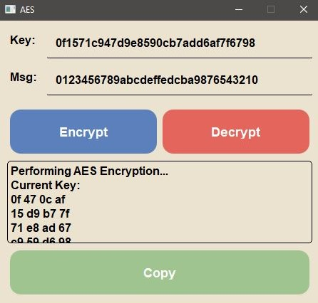

  <h1>AES(Advanced Encryption Standard)</h1>

This application applies the AES algorithm to encrypt/decrypt a 128 bit message block.

The inputs are feed in as HEX and the ouput shows how the state of the message changes after each round.

